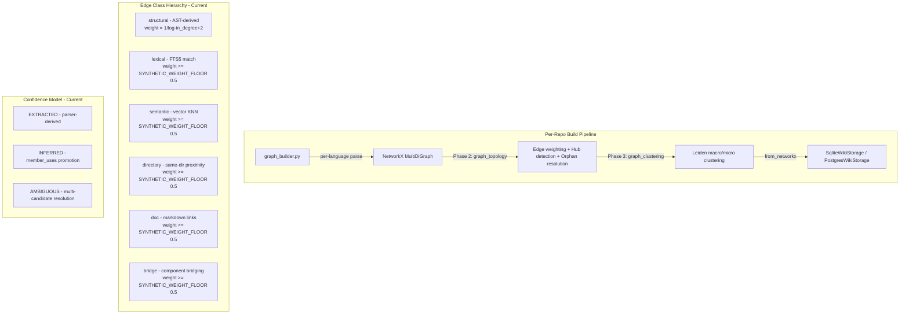
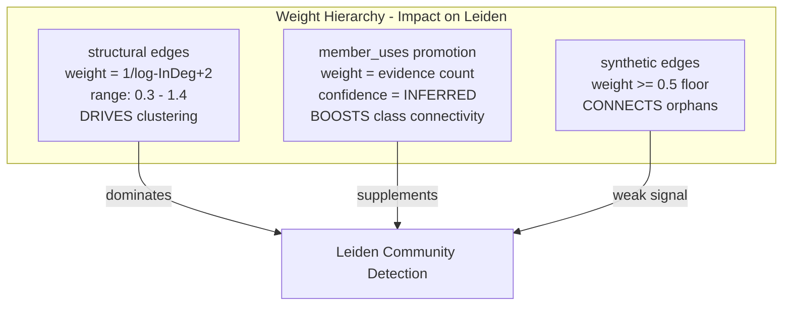
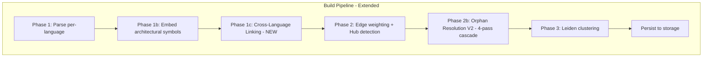
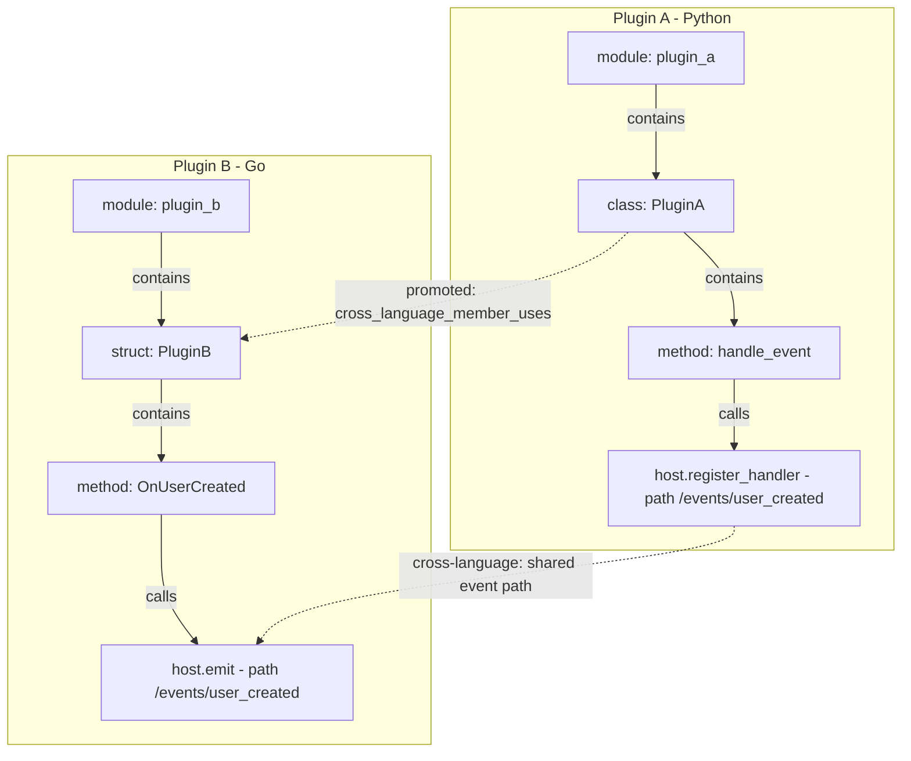
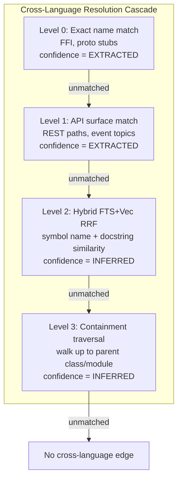
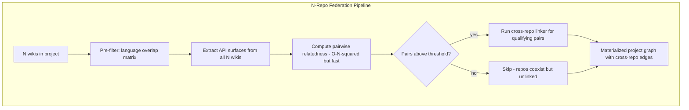
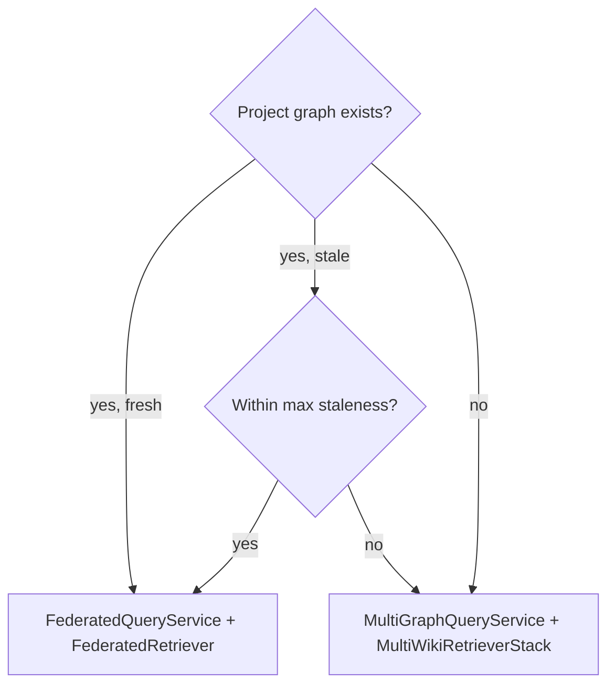
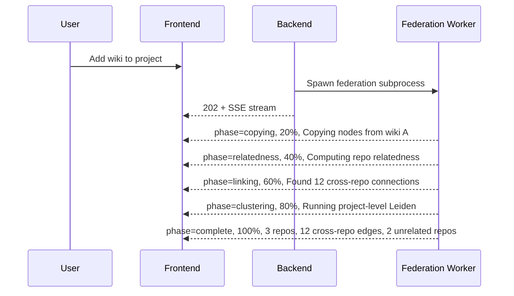

# Cross-Language Connections & Graph Federation — V4

> **Related Documents** (must be read alongside this plan):
> - [`PLANNING_GRAPH_QUALITY_IMPROVEMENTS.md`](PLANNING_GRAPH_QUALITY_IMPROVEMENTS.md) — IDF-gated lexical resolution, node disambiguation, edge provenance
> - [`PLANNING_ORPHAN_RESOLUTION_V2.md`](PLANNING_ORPHAN_RESOLUTION_V2.md) — Cascade reorder, hybrid RRF search, embedding performance
> - [`INVESTIGATION_GRAPH_QUALITY.md`](INVESTIGATION_GRAPH_QUALITY.md) — Mega-cluster analysis, orphan archetypes, class transitive coupling
> - [`GRAPH_QUALITY_IMPROVEMENTS.md`](GRAPH_QUALITY_IMPROVEMENTS.md) — Tiered lexical matching, REST disambiguation, diagnostics
> - [deepwiki_plugin `PLANNING_CLUSTERING_V2.md`](../deepwiki_plugin/PLANNING_CLUSTERING_V2.md) — Leiden micro-clustering, dominant symbols, doc routing (**Note**: InfoMap was attempted but causes segmentation faults in production — `igraph.community_infomap()` crashes the Python process. Leiden remains the only viable algorithm. This reference is kept for historical context.)

---

## Problem Statement

Currently, the wikis project handles multi-repository projects via **query-time fanout**:
- [`MultiGraphQueryService`](backend/app/core/code_graph/multi_graph_query_service.py) fans out every query to N per-wiki `GraphQueryService` instances
- [`MultiWikiRetrieverStack`](backend/app/core/multi_retriever.py) fans out embedding retrieval to N per-wiki retriever stacks
- [`build_multi_wiki_components()`](backend/app/services/multi_wiki_components.py) assembles these by loading each wiki independently

**Problems:**
1. **No cross-repo edges** — repos in a project have zero graph connections
2. **No cross-language edges within a repo** — parsers run independently per language
3. **N×latency for graph queries** — fan-out to all wikis
4. **No unified clustering** — Leiden runs per-repo only
5. **No BDD/test-to-code mapping** — step definitions disconnected from feature files
6. **No ABI/FFI boundary detection** — WebAssembly, ctypes, cgo, JNI invisible
7. **Unrelated projects** — users can group unrelated repos, risking spurious edges

---

## Current Architecture



### Critical Observations from Related Documents

1. **Clustering is Leiden-first, Louvain-fallback**: [`graph_clustering.py`](backend/app/core/graph_clustering.py) uses `leidenalg.find_partition()` with `RBConfigurationVertexPartition`. Louvain is fallback only.

2. **Edge weighting excludes synthetic classes from in-degree**: `_SYNTHETIC_CLASSES = frozenset({"directory", "lexical", "semantic", "doc", "bridge"})` in [`graph_topology.py`](backend/app/core/graph_topology.py:98). Structural edges drive the `1/log(InDegree+2)` formula; synthetic edges get `SYNTHETIC_WEIGHT_FLOOR = 0.5`.

3. **Mega-cluster problem is real** ([`INVESTIGATION_GRAPH_QUALITY.md`](INVESTIGATION_GRAPH_QUALITY.md) §F1-F2): Hub files like `artifact.py` with edges to 130+ files defeat Leiden modularity. Adding MORE edges without careful weighting will make this WORSE.

4. **Orphan resolution V2 plans hybrid RRF** ([`PLANNING_ORPHAN_RESOLUTION_V2.md`](PLANNING_ORPHAN_RESOLUTION_V2.md) §3): 4-pass cascade: Explicit refs → Hybrid FTS+Vec → Lexical-only → Directory. Cross-language linking must integrate with this, not duplicate it.

5. **IDF gating prevents edge flooding** ([`PLANNING_GRAPH_QUALITY_IMPROVEMENTS.md`](PLANNING_GRAPH_QUALITY_IMPROVEMENTS.md) §2.3): Common symbols like `get`, `shared`, `config` are suppressed. Cross-language edges must respect the same IDF discipline.

6. **Test exclusion in cluster mode**: Tests are excluded from wiki content generation but kept for ask/research. Test-to-code edges must NOT pull test nodes into non-test clusters during Leiden.

7. **Class transitive coupling** ([`INVESTIGATION_GRAPH_QUALITY.md`](INVESTIGATION_GRAPH_QUALITY.md) §F4): 152 "rescuable" classes have zero direct edges but rich transitive edges through members. `member_uses` promotion (P1 in the investigation) addresses this. Cross-language linking should leverage the same pattern — a Python class calling a Go service through its methods should get a promoted `cross_language_member_uses` edge.

8. **Parsers already extract decorators and `extern` modifiers**: Python parser captures `@app.route`, TypeScript captures Angular/NestJS decorators, Rust tracks `extern crate` aliases and `is_extern` modifiers, C++ detects `has_extern`. These are stored in `metadata['decorators']` but never cross-referenced.

---

## The Edge Weight Problem — Why This Is Hard

Adding cross-language and cross-repo edges is not just "add more edges." The current system has a carefully tuned weight hierarchy:



**The danger**: If cross-language edges get `weight = 0.5` (same as synthetic), they're too weak to influence clustering. If they get `weight = 1.0+` (same as structural), they can create mega-clusters by bridging unrelated language domains.

**The solution**: A new edge class `"cross_language"` with its own weight tier:

| Edge Class | Weight Range | In-Degree Contribution | Leiden Impact |
|-----------|-------------|----------------------|---------------|
| `structural` | 0.3 – 1.4 | YES (drives weighting) | Primary signal |
| `cross_language` | **0.3 – 0.8** (new) | **NO** (excluded like synthetic) | **Secondary signal** — strong enough to influence clustering but not dominate |
| `lexical` | 0.5 floor | NO | Weak signal |
| `semantic` | 0.5 floor | NO | Weak signal |
| `directory` | 0.5 floor | NO | Weak signal |
| `doc` | 0.5 floor | NO | Weak signal |
| `bridge` | 0.5 floor | NO | Weak signal |

**Cross-language weight formula**:
```
weight = base_confidence × locality_factor × specificity_factor

where:
  base_confidence:
    EXTRACTED (explicit annotation/decorator) = 0.8
    INFERRED (name matching) = 0.5
    AMBIGUOUS (embedding similarity) = 0.3

  locality_factor:
    same directory = 1.0
    same package/module = 0.8
    different package = 0.6

  specificity_factor:
    exact function name match = 1.0
    class name match = 0.9
    REST path match = 0.8
    embedding similarity > 0.85 = 0.6
```

This ensures:
- A Python `@app.route("/users")` ↔ TypeScript `fetch("/users")` gets `0.8 × 0.6 × 0.8 = 0.384` — meaningful but won't dominate
- A Rust `#[wasm_bindgen] fn calculate()` ↔ JS `wasm.calculate()` gets `0.8 × 0.8 × 1.0 = 0.64` — strong signal for same-package FFI
- A vague name match `User` in Python ↔ `User` in Go gets `0.5 × 0.6 × 0.9 = 0.27` — weak, won't distort clustering

### Integration with Orphan Resolution V2

Cross-language linking runs **before** orphan resolution. This is critical because:
1. Cross-language edges may resolve orphans that would otherwise need the expensive hybrid RRF cascade
2. Orphan resolution's explicit-ref Pass 1 can leverage cross-language API surface metadata
3. The hybrid Pass 2 benefits from cross-language edges already in the graph (they provide additional candidates for RRF fusion)



### Test-to-Code Edge Safety

Test-to-code edges (`tests` edge type) require special handling to avoid breaking the cluster-mode test exclusion:

1. **Edge class**: `"test_link"` (new, separate from `"cross_language"`)
2. **Leiden behavior**: Test nodes are already excluded from clustering when `exclude_tests=True`. Test-to-code edges are excluded from the architectural projection used by Leiden.
3. **Ask/Research behavior**: Test-to-code edges ARE traversed during ask/research queries, providing the "Python integration tests → C++ code" linkage you described (like Redpanda).
4. **Weight**: `SYNTHETIC_WEIGHT_FLOOR` (0.5) — same as other synthetic edges, ensuring they don't influence clustering even when tests are included.

---

## Phase 1: Cross-Language Linker (Intra-Repo)

### Plugin-Based Architecture Pattern

You raised the critical case of plugin architectures where plugins are separate repos connected via:
- **Direct transitive dependencies**: HTTP paths, function names matching plugin functionality
- **Indirect connections**: Calls to methods in different parts of plugins that share a host API

This pattern requires **multi-hop traversal** during cross-repo linking (Phase 3), not just surface-level matching. The LSP-like containment hierarchy (`module → class → method → field`) means:



The key insight: the direct cross-language edge is between `handle_event` and `OnUserCreated` (they share the event path `/events/user_created`). But the **useful** edge for clustering and understanding is between `PluginA` and `PluginB` — the parent containers. This requires **member-uses promotion** (same pattern as [`INVESTIGATION_GRAPH_QUALITY.md`](INVESTIGATION_GRAPH_QUALITY.md) §P1):

```python
# After creating cross-language edges between methods:
# Promote to parent containers (class/struct/module)
for edge in cross_language_edges:
    source_parent = get_architectural_parent(edge.source)
    target_parent = get_architectural_parent(edge.target)
    if source_parent and target_parent and source_parent != target_parent:
        add_edge(source_parent, target_parent,
                 rel_type='cross_language_member_uses',
                 edge_class='cross_language',
                 confidence='INFERRED',
                 weight=0.5)  # Promoted, not direct
```

### Hybrid Search for Cross-Language Resolution

You're right that pure semantic search isn't enough. The cross-language linker should use **hybrid search with multi-level traversal**:

1. **Level 0 — Exact match**: Function/method names that are identical across languages (FFI boundary, shared proto)
2. **Level 1 — API surface match**: REST paths, event names, message queue topics extracted from decorators/annotations
3. **Level 2 — Hybrid FTS+Vec**: For remaining unmatched API surfaces, use the same RRF fusion from Orphan Resolution V2 — FTS on symbol names + vector similarity on docstrings/signatures
4. **Level 3 — Containment traversal**: Walk up the containment hierarchy (method → class → module) and try matching at each level. A Python `UserService.create_user()` might not match Go `CreateUser()` at method level, but `UserService` ↔ `UserHandler` matches at class level.



### API Surface Categories

| Category | Detection Signal | Languages | Confidence |
|----------|-----------------|-----------|------------|
| REST endpoints | `@app.route`, `@GetMapping`, `router.get()`, `http.HandleFunc()` | Python, Java, TS/JS, Go | EXTRACTED |
| gRPC/Proto | `.proto` service definitions, generated stubs | All | EXTRACTED |
| FFI/ABI | `extern "C"`, `#[wasm_bindgen]`, `ctypes.CDLL`, `import "C"`, `native` keyword | C/C++, Rust, Python, Go, Java | EXTRACTED |
| BDD steps | `.feature` Gherkin → `@given/@when/@then` decorators | Python, Java, JS/TS, Ruby | EXTRACTED |
| Shared types | Same class/struct name + field similarity across languages | All | INFERRED |
| Event channels | Message queue topic strings, event emitter names | All | INFERRED |
| Test-to-code | Test file imports + naming conventions (`test_X.py` → `X.py`) | All | EXTRACTED/INFERRED |

### Integration Point in Build Pipeline

The cross-language linker runs as Phase 1c in [`graph_builder.py`](backend/app/core/code_graph/graph_builder.py), after all per-language parsing completes but **before** Phase 2 (edge weighting + orphan resolution):

```python
# In graph_builder.py, after _build_graph() completes:
if len(languages_in_repo) >= 2 or has_feature_files or has_proto_files:
    from .cross_language_linker import CrossLanguageLinker
    linker = CrossLanguageLinker(graph, storage, embedding_fn)
    cross_lang_stats = linker.link()
    logger.info("Cross-language linking: %d edges added", cross_lang_stats['edges_added'])
```

### New Files

| File | Purpose |
|------|---------|
| `backend/app/core/code_graph/cross_language_linker.py` | Orchestrator: 4-level cascade, member-uses promotion |
| `backend/app/core/code_graph/api_surface_extractor.py` | Per-language API surface extraction |

### Files to Modify

| File | Change |
|------|--------|
| [`graph_builder.py`](backend/app/core/code_graph/graph_builder.py) | Add Phase 1c cross-language linking post-pass |
| [`graph_topology.py`](backend/app/core/graph_topology.py) | Add `"cross_language"` and `"test_link"` to `_SYNTHETIC_CLASSES` for in-degree exclusion; add weight tier for cross-language edges |
| [`constants.py`](backend/app/core/constants.py) | Add new edge types, edge classes |
| [`storage/protocol.py`](backend/app/core/storage/protocol.py) | Add `api_surface` column to node schema |
| [`storage/sqlite.py`](backend/app/core/storage/sqlite.py) | Schema migration for `api_surface` |
| [`storage/postgres.py`](backend/app/core/storage/postgres.py) | Schema migration for `api_surface` |

---

## Phase 2: Project Graph Storage

### Schema

**SQLite**: `{project_id}.project.db` | **Postgres**: `project_{project_id}` schema

```sql
CREATE TABLE project_nodes (
    node_id         TEXT PRIMARY KEY,       -- wiki_id::original_node_id
    source_wiki_id  TEXT NOT NULL,
    source_node_id  TEXT NOT NULL,
    rel_path        TEXT NOT NULL DEFAULT '',
    file_name       TEXT NOT NULL DEFAULT '',
    language        TEXT NOT NULL DEFAULT '',
    symbol_name     TEXT NOT NULL DEFAULT '',
    symbol_type     TEXT NOT NULL DEFAULT '',
    source_text     TEXT DEFAULT '',
    docstring       TEXT DEFAULT '',
    signature       TEXT DEFAULT '',
    api_surface     TEXT DEFAULT '',         -- JSON
    is_architectural INTEGER DEFAULT 0,
    is_doc           INTEGER DEFAULT 0,
    is_test          INTEGER DEFAULT 0,
    is_hub          INTEGER DEFAULT 0,
    macro_cluster   INTEGER DEFAULT NULL,    -- project-level
    micro_cluster   INTEGER DEFAULT NULL
);

CREATE TABLE project_edges (
    id              INTEGER PRIMARY KEY AUTOINCREMENT,
    source_id       TEXT NOT NULL,
    target_id       TEXT NOT NULL,
    rel_type        TEXT NOT NULL DEFAULT '',
    edge_class      TEXT NOT NULL DEFAULT 'structural',
    confidence      TEXT NOT NULL DEFAULT 'EXTRACTED',
    weight          REAL DEFAULT 1.0,
    source_wiki_id  TEXT DEFAULT '',
    target_wiki_id  TEXT DEFAULT '',
    is_cross_repo   INTEGER DEFAULT 0,
    is_cross_lang   INTEGER DEFAULT 0
);

CREATE TABLE repo_relatedness (
    wiki_id_a       TEXT NOT NULL,
    wiki_id_b       TEXT NOT NULL,
    score           REAL NOT NULL DEFAULT 0.0,
    language_overlap REAL DEFAULT 0.0,
    dependency_overlap REAL DEFAULT 0.0,
    api_surface_overlap REAL DEFAULT 0.0,
    naming_overlap  REAL DEFAULT 0.0,
    linked          INTEGER DEFAULT 0,
    edges_created   INTEGER DEFAULT 0,
    PRIMARY KEY (wiki_id_a, wiki_id_b)
);

CREATE TABLE project_meta (
    key   TEXT PRIMARY KEY,
    value TEXT
);
```

### Node ID Namespacing

```
{wiki_id}::{original_node_id}
```
Example: `wiki_abc123::python::src/auth/service.py::AuthService`

### Backend-Specific Federation Strategy (SQLite vs PostgreSQL)

The two storage backends require fundamentally different federation approaches:

#### SQLite: Cross-Database ATTACH

SQLite stores each wiki in a separate `.wiki.db` file. Federation options:

| Approach | Mechanism | Pros | Cons |
|----------|-----------|------|------|
| **ATTACH + INSERT INTO** | `ATTACH DATABASE 'wiki_a.wiki.db' AS wiki_a; INSERT INTO project_nodes SELECT ... FROM wiki_a.repo_nodes` | Native SQLite, fast bulk copy, single-process | Max 10 attached DBs by default (configurable to 125 via `SQLITE_MAX_ATTACHED`); FTS5 virtual tables cannot be queried across attached DBs |
| **Materialized copy** (recommended) | Open each wiki DB sequentially, read all rows, write to project DB | No ATTACH limit; FTS5 works natively in project DB | Slightly slower than ATTACH for bulk copy; requires sequential processing |
| **Virtual table federation** | `CREATE VIRTUAL TABLE ... USING csv(...)` or custom vtab | Zero-copy reads | Complex, fragile, no FTS5 support |

**Recommended for SQLite**: Materialized copy. Open each wiki `.wiki.db` in read-only mode, iterate `repo_nodes` and `repo_edges`, namespace node IDs, and INSERT into the project `.project.db`. Rebuild FTS5 and sqlite-vec indexes in the project DB.

```python
# SQLite federation pseudocode
def federate_sqlite(project_db_path, wiki_db_paths, wiki_ids):
    project_db = SqliteProjectStorage(project_db_path)
    for wiki_id, wiki_path in zip(wiki_ids, wiki_db_paths):
        wiki_db = SqliteWikiStorage(wiki_path, readonly=True)
        nodes = wiki_db.get_all_nodes()
        edges = wiki_db.get_all_edges()
        # Namespace and insert
        for node in nodes:
            node['node_id'] = f"{wiki_id}::{node['node_id']}"
            node['source_wiki_id'] = wiki_id
            node['source_node_id'] = node['node_id'].split('::', 1)[1]
        project_db.upsert_nodes_batch(nodes)
        # ... same for edges with namespaced source_id/target_id
    project_db.rebuild_fts()
    project_db.rebuild_vec()
```

#### PostgreSQL: Cross-Schema Queries

PostgreSQL stores each wiki in a separate schema (`wiki_{repo_id}`). Federation options:

| Approach | Mechanism | Pros | Cons |
|----------|-----------|------|------|
| **Cross-schema INSERT INTO ... SELECT** | `INSERT INTO project_{id}.project_nodes SELECT ... FROM wiki_a.repo_nodes` | Single SQL statement per wiki, server-side, very fast | Requires all schemas on same server (always true in our setup) |
| **Foreign Data Wrapper** | `postgres_fdw` for remote schemas | Works across servers | Overkill for same-server; performance overhead |
| **Materialized view** | `CREATE MATERIALIZED VIEW project_nodes AS SELECT ... FROM wiki_a.repo_nodes UNION ALL SELECT ... FROM wiki_b.repo_nodes` | Zero-copy, auto-refreshable | No FTS trigger on matview; no custom indexes; refresh is full rebuild |
| **Cross-schema INSERT** (recommended) | Direct `INSERT INTO ... SELECT` with schema-qualified table names | Fast, native, supports FTS triggers | Requires sequential per-wiki INSERT |

**Recommended for PostgreSQL**: Cross-schema `INSERT INTO ... SELECT`. The project schema (`project_{project_id}`) gets its own `project_nodes`, `project_edges` tables with the same FTS trigger infrastructure as per-wiki schemas. The tsvector trigger fires on INSERT, so FTS is built incrementally.

```sql
-- PostgreSQL federation: copy wiki_a nodes into project schema
INSERT INTO project_abc.project_nodes
    (node_id, source_wiki_id, source_node_id, rel_path, file_name, language,
     symbol_name, symbol_type, source_text, docstring, signature, api_surface,
     is_architectural, is_doc, is_test, is_hub)
SELECT
    'wiki_a::' || node_id,      -- namespaced node_id
    'wiki_a',                    -- source_wiki_id
    node_id,                     -- source_node_id
    rel_path, file_name, language, symbol_name, symbol_type,
    source_text, docstring, signature, '',  -- api_surface initially empty
    is_architectural, is_doc, is_test, is_hub
FROM wiki_a.repo_nodes;

-- Copy edges with namespaced IDs
INSERT INTO project_abc.project_edges
    (source_id, target_id, rel_type, edge_class, confidence, weight,
     source_wiki_id, target_wiki_id, is_cross_repo, is_cross_lang)
SELECT
    'wiki_a::' || source_id,
    'wiki_a::' || target_id,
    rel_type, edge_class, confidence, weight,
    'wiki_a', 'wiki_a', 0, 0
FROM wiki_a.repo_edges;

-- pgvector: copy embeddings
INSERT INTO project_abc.project_vec (node_id, embedding)
SELECT 'wiki_a::' || node_id, embedding
FROM wiki_a.repo_vec;
```

#### FTS Scoring Parity

The two backends have fundamentally different FTS scoring:

| Aspect | SQLite FTS5 | PostgreSQL tsvector |
|--------|------------|---------------------|
| Scoring function | `bm25()` — returns **negative** scores (more negative = better) | `ts_rank_cd()` — returns **positive** scores (higher = better) |
| Column weights | Positional: `bm25(repo_fts, 10.0, 4.0, 2.0, 1.0)` for symbol_name, signature, docstring, source_text | Zone weights via `setweight()`: A=symbol_name, B=signature, C=docstring, D=source_text |
| Query syntax | FTS5 MATCH: `"exact phrase"`, `prefix*`, `AND/OR/NOT` | `websearch_to_tsquery()`: natural language, `"quotes"`, `-NOT`, `or` |
| Exact phrase | `symbol_name : "UserService"` (column-specific) | `to_tsquery('english', 'UserService')` against weighted tsvector |

**For the project storage**, both backends must normalize FTS scores to a common scale. The `ProjectStorageProtocol` must define:

```python
def search_fts(self, query, ...) -> list[dict]:
    """Returns results with normalized fts_rank: higher = better, range [0, 1]."""
    # SQLite: negate BM25 and normalize
    # Postgres: ts_rank_cd already positive, normalize to [0, 1]
```

This normalization is already recommended in [`GRAPH_QUALITY_IMPROVEMENTS.md`](GRAPH_QUALITY_IMPROVEMENTS.md) §1.5 (Issue 1) — the project storage should implement it from day one.

### N-Repo Federation Scaling

The pairwise relatedness computation is O(N²) where N = number of repos in a project. For small projects this is fine, but it must scale:

| N repos | Pairs | Practical? |
|---------|-------|-----------|
| 2 | 1 | Trivial |
| 3 | 3 | Trivial |
| 5 | 10 | Fine |
| 10 | 45 | Fine |
| 13 | 78 | Acceptable |
| 20 | 190 | Needs optimization |
| 50 | 1225 | Needs batching |

**Scaling strategy**:

1. **Pre-filter by language overlap**: Before computing full relatedness, check if repos share any languages. Repos with zero language overlap get `score = 0` immediately (no need to compute dependency/API/naming overlap). This eliminates most pairs in heterogeneous projects.

2. **Batch API surface extraction**: Extract API surfaces from all N repos in one pass, then compute pairwise overlap using set intersection. This is O(N) for extraction + O(N²) for comparison, but the comparison is cheap (set operations on pre-computed surfaces).

3. **Incremental relatedness**: When a new wiki is added to a project with N existing wikis, only compute N new pairs (not re-compute all N×(N-1)/2). Store results in `repo_relatedness` table.

4. **Parallelism**: For Postgres, the cross-schema INSERT can run in parallel for independent wikis. For SQLite, sequential processing is required (single-writer), but the read phase (extracting nodes/edges from per-wiki DBs) can be parallelized.

5. **Project size cap**: Enforce a maximum of 50 wikis per project (configurable via `WIKI_MAX_PROJECT_SIZE`). Beyond this, the O(N²) relatedness computation and the unified graph size become impractical.



### New Files

| File | Purpose |
|------|---------|
| `backend/app/core/storage/project_storage.py` | `ProjectStorageProtocol` + SQLite/Postgres implementations with normalized FTS scoring |
| `backend/app/core/project_graph_builder.py` | Copy nodes/edges + cross-repo linking orchestration + N-repo scaling |

---

## Phase 3: Cross-Repo Linker

### Relatedness-Gated Matching

**Critical**: Before running any cross-repo matching, compute a **relatedness score** between each repo pair. Only attempt linking for pairs above threshold.

```
score = 0.3 × language_overlap + 0.2 × dependency_overlap + 0.3 × api_surface_overlap + 0.2 × naming_overlap
```

Threshold: `score >= 0.15` to attempt linking. Below → repos coexist in unified index but have zero cross-repo edges.

### Cross-Repo Edge Weighting

Cross-repo edges get an additional **dampening factor** of `0.7×` compared to intra-repo cross-language edges:

```
cross_repo_weight = intra_repo_cross_lang_weight × 0.7
```

This prevents Leiden from over-merging repos that share a few API endpoints. A cross-repo REST path match gets `0.384 × 0.7 = 0.269` — present but won't dominate.

### Plugin Architecture Pattern — Multi-Hop Resolution

For plugin-based architectures, the cross-repo linker must do **multi-hop traversal**:

1. Extract API surfaces from each repo (REST paths, event topics, host API calls)
2. Match surfaces across repos (same path/topic = direct connection)
3. **Walk the containment hierarchy**: If `PluginA.handle_event()` matches `PluginB.OnUserCreated()`, also create a promoted edge `PluginA` ↔ `PluginB`
4. **Transitive dependency resolution**: If Plugin A calls `host.get_plugin("B")` and Plugin B exposes `register()`, create an edge even though the connection is indirect

### New Files

| File | Purpose |
|------|---------|
| `backend/app/core/code_graph/cross_repo_linker.py` | Orchestrates cross-repo matching |
| `backend/app/core/code_graph/relatedness_scorer.py` | Pairwise repo relatedness |
| `backend/app/core/code_graph/api_matchers/` | REST, proto, import, type matchers |

---

## Phase 4: Project-Level Leiden Clustering

Re-run the existing Leiden pipeline on the federated graph:

1. Rehydrate project graph as `nx.MultiDiGraph`
2. `apply_edge_weights()` — with cross-repo edges in `_SYNTHETIC_CLASSES` (excluded from in-degree)
3. `detect_hubs()` — project-level hub detection
4. `architectural_projection()` — project-level
5. `macro_cluster()` (Leiden) → `micro_cluster()`
6. Persist project-level cluster assignments

**Cross-repo edge weight dampening in Leiden**: Cross-repo edges already have the 0.7× dampening from Phase 3. Additionally, during `apply_edge_weights()`, cross-repo edges get `max(w, SYNTHETIC_WEIGHT_FLOOR)` like other synthetic edges, ensuring they don't inflate in-degree counts.

**Test node handling**: Test nodes (`is_test=1`) are excluded from the architectural projection when `exclude_tests=True`, same as per-repo clustering. Test-to-code edges are excluded from the projection. This preserves the existing behavior where tests are available for ask/research but don't appear in wiki content.

---

## Phase 5: Federated Query Service + Retriever

### FederatedQueryService

Drop-in replacement for `MultiGraphQueryService`. Single query against project storage instead of N×fan-out.

Key improvement: `get_relationships()` traverses cross-repo edges natively:
```
AuthController.login()  [wiki_A, Python]
  → calls → AuthService.authenticate()  [wiki_A, Python]
    → cross_repo_api_call → UserService.validateToken()  [wiki_B, Go]
      → calls → TokenStore.verify()  [wiki_B, Go]
```

### FederatedRetriever

Drop-in replacement for `MultiWikiRetrieverStack`. Single hybrid search against project DB.

Graph-aware expansion follows cross-repo edges:
1. Search returns `AuthService.authenticate()` from wiki_A
2. Expansion follows `cross_repo_api_call` edge to `UserService.validateToken()` in wiki_B
3. Both included in results with `source_wiki_id` metadata

### Fallback Chain



### New Files

| File | Purpose |
|------|---------|
| `backend/app/core/code_graph/federated_query_service.py` | Project-level query service |
| `backend/app/core/federated_retriever.py` | Project-level retriever |

---

## Phase 6: Lifecycle, Triggers & UX

### Federation Progress UI

Mirror the wiki generation progress pattern:



### Trigger Points

| Event | Action |
|-------|--------|
| Wiki indexing completes | If wiki belongs to project → incremental rebuild |
| Wiki added to project | Copy + re-run cross-repo linker for new pairs |
| Wiki removed from project | Remove wiki's nodes/edges + affected cross-repo edges |
| Manual trigger | Full rebuild |

### Staleness Policy

- Serve stale while rebuilding (max `WIKI_PROJECT_GRAPH_MAX_STALE_SECONDS`, default 3600)
- Incremental rebuilds: only changed wiki's nodes/edges refreshed + cross-repo linker for affected pairs

---

## Phase 7: Feature Flags & Backward Compatibility

| Flag | Default | Purpose |
|------|---------|---------|
| `WIKI_CROSS_LANGUAGE_LINKING` | `0` | Enable cross-language edge detection within repos |
| `WIKI_PROJECT_GRAPH` | `0` | Enable materialized project graph storage |
| `WIKI_CROSS_REPO_LINKING` | `0` | Enable cross-repo edge detection |
| `WIKI_PROJECT_CLUSTERING` | `0` | Enable Leiden on project graph |
| `WIKI_FEDERATED_QUERY` | `0` | Use FederatedQueryService |
| `WIKI_FEDERATED_RETRIEVER` | `0` | Use FederatedRetriever |

### Compatibility Guarantees

1. **Single-wiki ask/research/code_map**: Zero changes
2. **Multi-wiki without project graph**: Falls back to existing fan-out
3. **Test exclusion in cluster mode**: Preserved — test-to-code edges use `"test_link"` edge class, excluded from architectural projection
4. **API contract**: Response shapes unchanged; `source_wiki_id` metadata added

---

## Implementation Order

**Recommended**: **Phase 2 → Phase 5 → Phase 1 → Phase 3 → Phase 4 → Phase 6 → Phase 7**

| Phase | Depends On | Risk | Impact |
|-------|-----------|------|--------|
| Phase 2: Project Graph Storage | None | Low | Foundation |
| Phase 5: Federated Query + Retriever | Phase 2 | Low | Eliminates fan-out latency |
| Phase 1: Cross-Language Linker | None | Medium | Improves single-repo quality |
| Phase 3: Cross-Repo Linker | Phase 1 + 2 | Medium | Cross-repo understanding |
| Phase 4: Project-Level Clustering | Phase 2 + 3 | Low | Cross-repo cluster coherence |
| Phase 6: Lifecycle & Triggers | Phase 2 + 3 | Low | Keeps graph fresh |
| Phase 7: Feature Flags | All | Low | Safe rollout |

---

## Testing Strategy

| Category | Scope |
|----------|-------|
| Unit: CrossLanguageLinker | Mock graph with Python + Go, verify cross-lang edges + member-uses promotion |
| Unit: API Surface Extractor | REST/gRPC/FFI/BDD extraction per language |
| Unit: RelatednessScorer | Related and unrelated repo pairs |
| Unit: Edge weighting | Verify cross-language edges get correct weight tier, excluded from in-degree |
| Integration: Project graph build | 2 real repos, verify node/edge counts |
| Integration: Incremental rebuild | Re-index one repo, verify partial refresh |
| Integration: Unrelated repos | Zero spurious cross-repo edges |
| Regression: Single-wiki ask | Results identical with/without cross-language linking |
| Regression: Test exclusion | Tests excluded from wiki content with cross-language edges present |
| Regression: Mega-cluster | Cross-language edges don't create new mega-clusters (verify largest cluster size) |
| Performance: Query latency | Fan-out vs federated on 5-wiki project |
| Performance: Build time | Project graph build for 10-wiki project |
| E2E: Plugin architecture | 2 plugin repos sharing host API, verify cross-repo edges via event paths |
| E2E: BDD linking | `.feature` + step definitions, verify edges |
| E2E: FFI linking | Rust + Python ctypes, verify cross-lang edges |

---

## Resolved Decisions

| Question | Decision | Rationale |
|----------|----------|-----------|
| Copy embeddings or re-embed? | **Copy** | Per-node text unchanged; re-embedding is expensive |
| Project-level Leiden? | **Yes** | Cross-repo clusters essential for multi-repo understanding |
| Staleness tolerance? | **Serve stale, max 1 hour** | Users shouldn't wait for federation |
| Storage budget? | **500K node cap**, architectural-only projection for larger projects | Prevents unbounded growth |
| Unrelated repos? | **Relatedness scoring + threshold gating** | Prevents spurious edges |
| Cross-language edge weight? | **New tier: 0.3–0.8**, excluded from in-degree | Strong enough for clustering, won't create mega-clusters |
| Test-to-code edges? | **Separate `test_link` edge class**, excluded from architectural projection | Preserves test exclusion in cluster mode |
| Plugin architecture? | **Multi-hop traversal + member-uses promotion** | Captures indirect connections through containment hierarchy |
