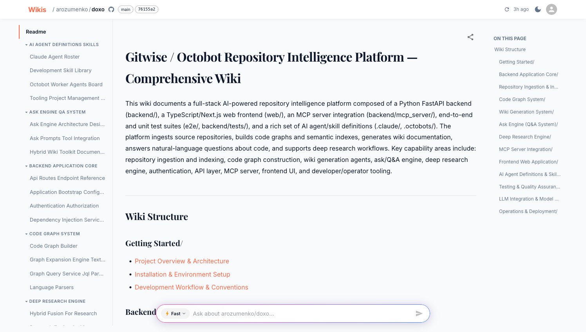
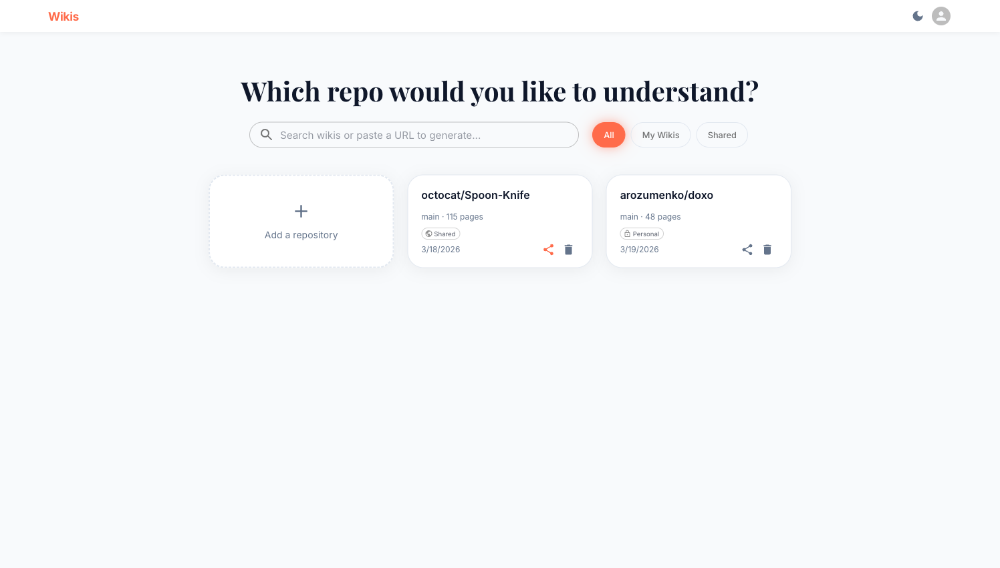
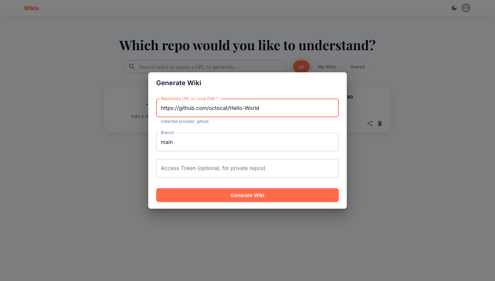
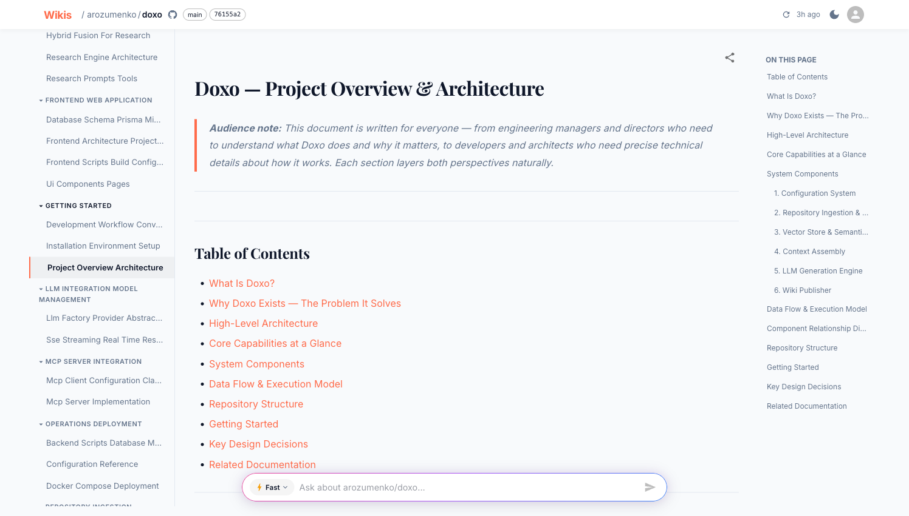
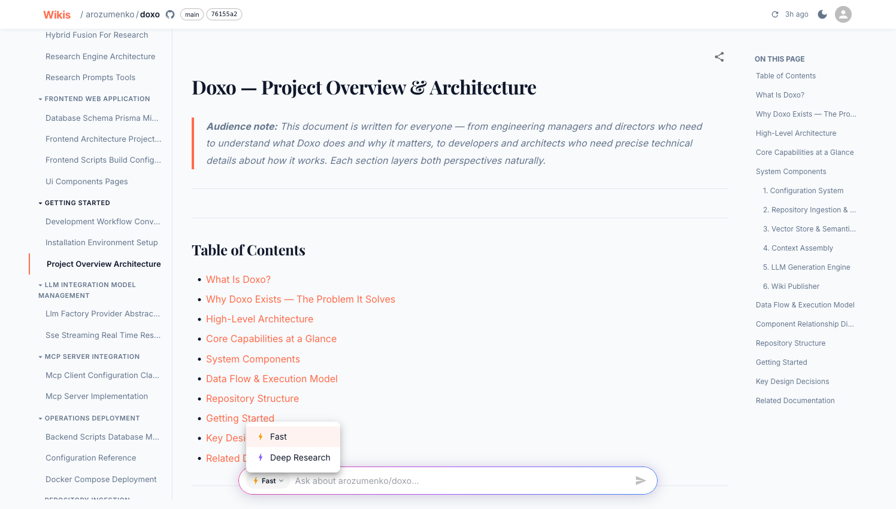

# Wikis

[](https://snyk.io/test/github/arozumenko/wikis)

AI-powered documentation generator that turns any code repository into a browsable, searchable wiki with architecture diagrams, code explanations, and an AI Q&A assistant.

<p align="center">
  
</p>

## Features

- **Instant wiki generation** — point at any GitHub, GitLab, Bitbucket, or Azure DevOps repo and get a comprehensive wiki in minutes
- **14+ languages** — tree-sitter parsing for Python, TypeScript, Java, Go, Rust, C++, Ruby, PHP, Kotlin, Swift, and more
- **AI Q&A** — ask questions about any repository and get source-cited answers
- **Deep Research** — multi-step agentic research engine for complex codebase questions with tool calls and planning
- **Mermaid diagrams** — auto-generated architecture, sequence, and flow diagrams
- **MCP Server** — use your wikis directly from Claude Code, Cursor, or Windsurf
- **Multiple LLM providers** — OpenAI, Anthropic, Google Gemini, Ollama (fully local), AWS Bedrock
- **Self-hosted** — runs entirely on your infrastructure with a single `docker compose up`
- **Authentication** — built-in username/password, GitHub OAuth, Google OAuth

## Quick Start

One command to install and run:

```bash
curl -fsSL https://raw.githubusercontent.com/arozumenko/wikis/main/install.sh | bash
```

The installer will prompt for your LLM provider, generate JWT keys, and start everything via Docker Compose.

Or manually:

```bash
git clone https://github.com/arozumenko/wikis.git && cd wikis
cp .env.example .env    # Edit: set LLM_PROVIDER and LLM_API_KEY
docker compose up -d
```

> **Windows:** The install script requires bash (WSL or Git Bash). Alternatively, clone the repo, copy `.env.example` to `.env`, fill in your LLM key, and run `docker compose up -d`.

Open **http://localhost:3000** and log in: `admin@wikis.dev` / `changeme123`

> Change the default password immediately after first login.

## How It Works

```
Repository URL
     │
     ▼
┌─────────────┐    ┌──────────────┐    ┌───────────────┐
│  Clone repo  │───▶│ Parse code   │───▶│ Build indexes │
│  (git)       │    │ (tree-sitter)│    │ (FAISS + BM25)│
└─────────────┘    └──────────────┘    └───────┬───────┘
                                               │
                                               ▼
                                    ┌──────────────────┐
                                    │  Generate wiki    │
                                    │  (LangGraph agent)│
                                    └────────┬─────────┘
                                             │
                                    ┌────────▼─────────┐
                                    │  Browsable wiki   │
                                    │  + AI Q&A + MCP   │
                                    └──────────────────┘
```

## Architecture

| Service | Port | Description |
|---------|------|-------------|
| **Web App** | 3000 | Next.js 15 — React SPA + Better-Auth (JWT, OAuth) |
| **Backend** | 8000 | FastAPI — wiki engine, Q&A, deep research, MCP server |

Both services ship as Docker images on GitHub Container Registry:

```bash
docker pull ghcr.io/arozumenko/wikis/web:latest
docker pull ghcr.io/arozumenko/wikis/backend:latest
```

## LLM Providers

| Provider | Models | Embeddings |
|----------|--------|------------|
| **OpenAI** | gpt-4o, gpt-4o-mini | text-embedding-3-large |
| **Anthropic** | claude-sonnet-4-6, claude-haiku-4-5 | requires secondary provider |
| **Google Gemini** | gemini-2.5-pro, gemini-2.0-flash | text-embedding-004 |
| **Ollama** | llama3.2, qwen3.5 (local) | nomic-embed-text |
| **AWS Bedrock** | Claude, Titan (enterprise) | titan-embed-text-v1 |
| **OpenAI-compatible** | Any (Together, Groq, vLLM, LM Studio) | varies |

Set `LLM_PROVIDER` and `LLM_API_KEY` in `.env` to switch.

## MCP Integration

Connect your AI IDE to Wikis for codebase-aware answers directly in your editor:

```json
{
  "mcpServers": {
    "wikis": {
      "url": "http://localhost:3000/mcp"
    }
  }
}
```

Works with Claude Code, Cursor, Windsurf, and any MCP-compatible client.

## Screenshots

<table>
  <tr>
    <td><strong>Dashboard</strong></td>
    <td><strong>Generate Wiki</strong></td>
  </tr>
  <tr>
    <td></td>
    <td></td>
  </tr>
  <tr>
    <td><strong>Wiki Content</strong></td>
    <td><strong>Ask Mode</strong></td>
  </tr>
  <tr>
    <td></td>
    <td></td>
  </tr>
</table>

## Documentation

Full documentation at **[arozumenko.github.io/wikis](https://arozumenko.github.io/wikis)**

- [Quick Start](https://arozumenko.github.io/wikis/docs/quickstart) — first-time setup
- [Self-Hosting](https://arozumenko.github.io/wikis/docs/self-hosting) — deployment and configuration
- [LLM Providers](https://arozumenko.github.io/wikis/docs/llm-providers) — provider setup and model selection
- [MCP Integration](https://arozumenko.github.io/wikis/docs/mcp-integration) — AI IDE integration

## Contributing

See [CONTRIBUTING.md](CONTRIBUTING.md) for development setup and guidelines.

## License

MIT — see [LICENSE](LICENSE).
