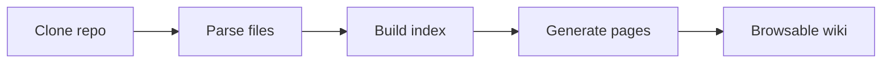

The wiki viewer has three panels:

| Panel | Location | Purpose |
|-------|----------|---------|
| **Sidebar** | Left | Navigate between pages and sections |
| **Content** | Center | Rendered markdown with diagrams and code |
| **On This Page** | Right | Jump to headings within the current page |

## The header

The header shows:
- **Breadcrumb** — `Wikis / owner / repo` with links back to the dashboard
- **Branch** badge — the branch this wiki was generated from
- **Commit hash** — links to the exact commit on GitHub/GitLab
- **↺ Refresh** — re-generate the wiki (owner only)
- **Indexed timestamp** — when the wiki was last generated

## Sidebar navigation

Pages are grouped into sections. Click a **section header** to navigate to the section's overview page (a table of contents listing every page in the section). Use the **chevron icon** to the right of the header to collapse or expand the section without navigating away. The currently active page is highlighted.

<Tip>
  On mobile, the sidebar collapses into a drawer. Tap the menu icon in the top-left to open it.
</Tip>

<Note>
  The sidebar is temporarily hidden while a Q&A conversation thread is active, to give more space to the conversation. It reappears when you clear the conversation or navigate away.
</Note>

## Page content

Wiki pages are rendered GitHub-flavoured Markdown with:

### Callout blocks

Wiki pages use Obsidian-style callout blocks for highlighted notes, warnings, tips, and examples:

> [!tip] Performance tip
> Use the cached JWKS endpoint rather than fetching the public key on every request.

Six callout types are supported, each rendered with a colour-coded border and emoji label:

| Type | Colour | Use |
|------|--------|-----|
| `[!abstract]` | Blue | Summaries, overviews |
| `[!info]` | Cyan | Informational notes |
| `[!tip]` | Green | Recommendations |
| `[!warning]` | Orange | Cautions, edge cases |
| `[!example]` | Purple | Code examples, walkthroughs |
| `[!danger]` | Red | Breaking changes, destructive operations |

### Properties panel

Each wiki page begins with a YAML frontmatter block. This renders as a collapsible **Properties** panel at the top of the page, showing metadata the AI extracted from the code:

- **Title** — the page title
- **Tags** — architectural layer, domain, or feature area
- **Type** — `module`, `architecture`, `api`, `guide`, or `overview`
- **Source files** — repository paths of source files this page documents
- **Symbols** — key functions, classes, or types covered on the page

Click the panel header to collapse it and return to full reading width.

### Syntax-highlighted code blocks

Every code block shows the language and a **Copy** button.

```python
def generate_wiki(repo_url: str, branch: str = "main") -> str:
    """Kick off wiki generation and return the wiki_id."""
    ...
```

### Mermaid diagrams

Architecture diagrams, sequence diagrams, and flowcharts are embedded as interactive SVGs:



### Internal links and wikilinks

Links between wiki pages navigate within the viewer — no full page reload. Pages link to each other using [Obsidian wikilink syntax](https://help.obsidian.md/Linking+notes+and+files/Internal+links):

- `[[Page Title]]` — links to the page whose title matches
- `[[Page Title|Display Text]]` — link with custom anchor text
- `[[source/path/file.py|file.py]]` — links to source file stub pages

Standard Markdown links (`[text](url)`) and anchor links (`#section-heading`) also work.

### Tables

Capability tables and API references are rendered as styled HTML tables.

## On This Page

The right-hand **On This Page** panel lists every heading on the current page. Click any entry to scroll directly to that section. The panel stays fixed as you scroll.

## Sharing a page link

Click the **share** icon (↗) in the top-right corner of any page to copy a direct link. Shared-link recipients must be authenticated to view the wiki.

## Keyboard navigation

| Key | Action |
|-----|--------|
| `Enter` in Ask bar | Submit question |
| `Shift + Enter` | New line in Ask bar |
| Clicking a sidebar item | Navigate to page |
| Clicking a TOC item | Scroll to heading |

## Obsidian compatibility

Every wiki is structured as an Obsidian-compatible vault. See [Obsidian Integration](/guide/obsidian-integration) for a full guide on opening wikis in Obsidian, using graph view, and working with wikilinks and source file stubs.
