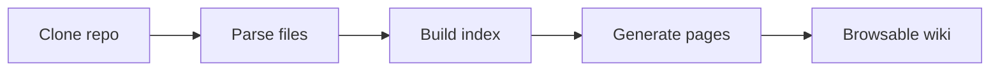

The wiki viewer has three panels:

| Panel | Location | Purpose |
|-------|----------|---------|
| **Sidebar** | Left | Navigate between pages and sections |
| **Content** | Center | Rendered markdown with diagrams and code |
| **On This Page** | Right | Jump to headings within the current page |

## The header

The header shows:
- **Breadcrumb** — `Wikis / owner / repo` with links back to the dashboard
- **Branch** badge — the branch this wiki was generated from
- **Commit hash** — links to the exact commit on GitHub/GitLab
- **↺ Refresh** — re-generate the wiki (owner only)
- **Indexed timestamp** — when the wiki was last generated

## Sidebar navigation

Pages are grouped into sections. Click a section header to collapse or expand it. The currently active page is highlighted.

<Tip>
  On mobile, the sidebar collapses into a drawer. Tap the menu icon in the top-left to open it.
</Tip>

## Page content

Wiki pages are rendered GitHub-flavoured Markdown with:

### Syntax-highlighted code blocks

Every code block shows the language and a **Copy** button.

```python
def generate_wiki(repo_url: str, branch: str = "main") -> str:
    """Kick off wiki generation and return the wiki_id."""
    ...
```

### Mermaid diagrams

Architecture diagrams, sequence diagrams, and flowcharts are embedded as interactive SVGs:



### Internal links

Links between wiki pages navigate within the viewer — no full page reload.

### Tables

Capability tables and API references are rendered as styled HTML tables.

## On This Page

The right-hand **On This Page** panel lists every heading on the current page. Click any entry to scroll directly to that section. The panel stays fixed as you scroll.

## Sharing a page link

Click the **share** icon (↗) in the top-right corner of any page to copy a direct link. Shared-link recipients must be authenticated to view the wiki.

## Keyboard navigation

| Key | Action |
|-----|--------|
| `Enter` in Ask bar | Submit question |
| `Shift + Enter` | New line in Ask bar |
| Clicking a sidebar item | Navigate to page |
| Clicking a TOC item | Scroll to heading |
