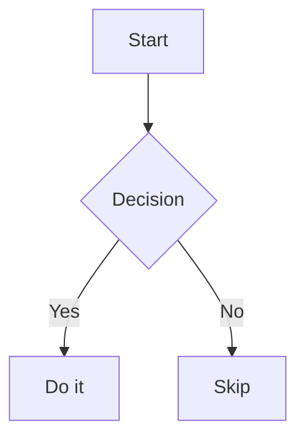

# Obsidian-Compatible Markdown Specification

A comprehensive reference for writing markdown files that are fully compatible with Obsidian's graph capabilities, backlinks, properties, and plugin ecosystem.

---

## 1. File Basics

- **Format:** Plain UTF-8 text files with `.md` extension
- **Location:** All files must live inside the Obsidian **vault** (the root folder)
- **Naming:** File names become default note titles; use descriptive names
  - Prefer `kebab-case` or `Title Case` (e.g., `api-design.md`, `API Design.md`)
  - Avoid special characters except `-` and `_`
  - Date prefix pattern for journals: `2025-01-15 Daily Note.md`

---

## 2. Frontmatter (YAML Properties)

Frontmatter must be the **first thing** in the file, enclosed in `---` delimiters.

```yaml
---
# Core Obsidian properties
tags:
  - project
  - backend
  - status/in-progress
aliases:
  - Alternative Title
  - Another Name
cssclasses:
  - wide-page

# Temporal metadata (ISO 8601)
created: 2025-01-15
updated: 2025-01-20
due: 2025-02-01

# Descriptive metadata
title: "My Note Title"
description: "Short summary for Obsidian Publish and listings"
status: draft           # draft | in-progress | done | archived
type: note              # note | project | person | concept | meeting | reference

# Publish-specific (Obsidian Publish only)
publish: true
permalink: my-note
image: /assets/cover.png
---
```

### 2.1 Built-in / Reserved Properties

| Property | Type | Purpose |
|---|---|---|
| `tags` | List | Connects note to tag nodes in graph |
| `aliases` | List | Alternative names for wikilink resolution |
| `cssclasses` | List | Custom CSS styling per note |
| `publish` | Boolean | Obsidian Publish inclusion |
| `permalink` | Text | Custom URL slug for Publish |
| `description` | Text | Summary shown in listings |
| `image` / `cover` | Text | Cover image path |

> **⚠️ Deprecated (Obsidian 1.4+, removed 1.9):** `tag`, `alias`, `cssclass` — use plural forms.

### 2.2 Property Types

| Type | YAML syntax | Example |
|---|---|---|
| Text | bare string or quoted | `status: draft` |
| Number | numeric | `rating: 4.5` |
| Boolean | `true`/`false` | `publish: false` |
| Date | `YYYY-MM-DD` | `created: 2025-01-15` |
| DateTime | `YYYY-MM-DDTHH:MM` | `meeting_time: 2025-01-15T14:30` |
| List (block) | `- item` per line | See `tags` example above |
| List (inline) | `[a, b, c]` | `platforms: [ios, android]` |

### 2.3 Wikilinks in Frontmatter

Standard YAML fields are **not** parsed for wikilinks by Obsidian core.  
To create graph edges via frontmatter, use inline `[[link]]` syntax in text-type values (limited core support as of Obsidian 1.x):

```yaml
---
parent: "[[Projects MOC]]"
related:
  - "[[API Design]]"
  - "[[System Architecture]]"
---
```

---

## 3. Linking — The Core of Graph View

Graph edges are created **only** by links. Two types create graph edges:

### 3.1 Wikilinks (Internal Links)

```markdown
[[Note Name]]                          → link to a note
[[Note Name|Display Text]]             → link with alias
[[Note Name#Heading]]                  → link to a specific heading
[[Note Name#^block-id]]                → link to a specific block
[[Note Name#Heading|Display Text]]     → link to heading with alias
![[Note Name]]                         → embed/transclude entire note
![[Note Name#Heading]]                 → embed a section
![[Note Name#^block-id]]               → embed a specific block
![[image.png]]                         → embed an image
![[image.png|300]]                     → embed image with width
![[image.png|300x200]]                 → embed image with dimensions
```

> **Graph impact:** Every `[[Link]]` creates an **edge** between the current note and the target note. Embeds (`![[...]]`) also create edges.

### 3.2 Markdown Links

```markdown
[Display Text](note-name.md)           → standard markdown link (works, creates graph edge)
[Display Text](https://example.com)    → external URL (shows as external node if enabled)
```

### 3.3 Block IDs (for precise referencing)

Add a block ID to any paragraph, list item, or block by appending `^identifier` at the end:

```markdown
This is an important conclusion. ^my-conclusion

- Item A
- Item B ^list-item-b

Then elsewhere link to it:
[[Note Name#^my-conclusion]]
![[Note Name#^my-conclusion]]
```

> Block IDs: Latin letters, numbers, and dashes only. Auto-generated IDs use 6-character alphanumeric codes.

---

## 4. Tags

Tags create **tag nodes** in the graph (visible when "Tags" filter is enabled in graph view).

### 4.1 Inline Tags

```markdown
This note is about #programming and #api-design.

Nested/hierarchical tags:
#status/draft
#project/wikis/backend
#type/reference
```

### 4.2 Frontmatter Tags

```yaml
tags:
  - programming
  - api-design
  - status/done
  - project/wikis/backend
```

> **Note:** In frontmatter, tags do NOT have the `#` prefix. Obsidian strips it automatically.

### 4.3 Tag Conventions

```
#type/<note-type>      → e.g., #type/project, #type/person, #type/concept
#status/<state>        → e.g., #status/draft, #status/done, #status/archived
#area/<domain>         → e.g., #area/backend, #area/frontend
#project/<name>        → e.g., #project/wikis
```

---

## 5. Graph View — What Creates Nodes and Edges

| Source | Creates | Notes |
|---|---|---|
| `.md` file | Node | Every file = 1 node |
| `[[Note]]` wikilink | Edge | File → linked file |
| `![[Note]]` embed | Edge | File → embedded file |
| `#tag` inline | Edge to tag node | Requires "Tags" enabled in graph |
| `tags:` frontmatter | Edge to tag node | Same as inline tags |
| Unresolved `[[Note]]` | Orphan node (hollow) | File not yet created |
| External URL | (Optional) external node | Requires "Existing files only" off |

### 5.1 Graph View Filters

The graph view supports filtering by:
- **Search:** `path:`, `file:`, `tag:` operators
- **Depth:** how many hops from a selected node to show
- **Toggles:** Attachments, Existing files only, Orphans, Tags

### 5.2 Local Graph

Open a local graph (Ctrl/Cmd+click a node) for any note to see its neighborhood — incoming links, outgoing links, and neighbor links up to configurable depth.

---

## 6. Callouts

Callouts are styled blockquotes. Syntax:

```markdown
> [!note] Optional Title
> Body text here.
> More body text.

> [!warning]+ Expanded by default
> Use + to expand, - to collapse by default.

> [!tip]- Collapsed by default
> This is hidden until expanded.
```

### 6.1 Standard Callout Types

| Type | Aliases | Color |
|---|---|---|
| `note` | | Blue |
| `abstract` | `summary`, `tldr` | Cyan |
| `info` | | Blue |
| `todo` | | Blue |
| `tip` | `hint`, `important` | Teal |
| `success` | `check`, `done` | Green |
| `question` | `help`, `faq` | Yellow |
| `warning` | `caution`, `attention` | Orange |
| `failure` | `fail`, `missing` | Red |
| `danger` | `error` | Red |
| `bug` | | Red |
| `example` | | Purple |
| `quote` | `cite` | Gray |

---

## 7. Obsidian-Specific Markdown Extensions

### 7.1 Highlights

```markdown
==highlighted text==
```

### 7.2 Comments (hidden in preview)

```markdown
%% This comment is invisible in Reading View %%

%%
Multi-line comment
%%
```

### 7.3 Math (LaTeX via MathJax)

```markdown
Inline: $E = mc^2$

Block:
$$
\sum_{i=1}^{n} x_i = \frac{n(n+1)}{2}
$$
```

### 7.4 Mermaid Diagrams

````markdown

````

### 7.5 Task Lists

```markdown
- [ ] Incomplete task
- [x] Completed task
- [/] In progress (Obsidian renders with special icon)
- [-] Cancelled
- [>] Forwarded/Deferred
- [!] Important
```

---

## 8. Dataview Plugin — Queryable Metadata

[Dataview](https://github.com/blacksmithgu/obsidian-dataview) is the de-facto standard plugin for querying notes. It reads frontmatter AND inline fields.

### 8.1 Inline Fields (Dataview-specific)

```markdown
Author:: [[John Doe]]
Status:: in-progress
Priority:: high
Due:: 2025-02-01

Inline within a sentence: This task was assigned to [Owner:: [[Jane]]] last week.
```

> **Note:** Inline fields use `::` (double colon). They do NOT create graph edges natively but can be queried by Dataview.

### 8.2 Dataview Query Examples

````markdown
```dataview
TABLE status, tags, created
FROM #project
WHERE status != "done"
SORT created DESC
```

```dataview
LIST
FROM [[API Design]]
```

```dataviewjs
const pages = dv.pages('"Projects"').where(p => p.status === "active");
dv.table(["Name", "Status"], pages.map(p => [p.file.link, p.status]));
```
````

### 8.3 Implicit Dataview Fields

Every file exposes these automatically:

| Field | Description |
|---|---|
| `file.name` | Filename without extension |
| `file.path` | Full path from vault root |
| `file.link` | Wikilink to the file |
| `file.size` | File size in bytes |
| `file.ctime` | Creation timestamp |
| `file.mtime` | Last modified timestamp |
| `file.tags` | All tags |
| `file.inlinks` | Notes linking TO this note |
| `file.outlinks` | Notes this note links TO |
| `file.frontmatter` | Raw frontmatter key-value map |
| `file.day` | Date from filename (if `YYYY-MM-DD` prefix) |

---

## 9. Recommended Note Templates

### 9.1 General Note

```markdown
---
tags:
  - type/note
aliases: []
created: {{date:YYYY-MM-DD}}
status: draft
---

# {{title}}

## Summary

## Main Content

## References

## Related
- [[Related Note 1]]
- [[Related Note 2]]
```

### 9.2 Project Note

```markdown
---
tags:
  - type/project
  - status/active
aliases: []
created: {{date:YYYY-MM-DD}}
status: active      # active | paused | done | cancelled
due: YYYY-MM-DD
owner: "[[Person Name]]"
---

# {{title}}

## Goal

## Tasks
- [ ] Task 1
- [ ] Task 2

## Notes

## Decisions

## Related
- [[Parent Project]]
```

### 9.3 Person / Contact

```markdown
---
tags:
  - type/person
aliases:
  - First Last
  - nickname
created: {{date:YYYY-MM-DD}}
role: Engineer
org: "[[Company Name]]"
---

# {{name}}

## Notes

## Meetings
- [[2025-01-15 Meeting with {{name}}]]

## Projects
- [[Project A]]
```

### 9.4 Concept / Evergreen Note

```markdown
---
tags:
  - type/concept
aliases: []
created: {{date:YYYY-MM-DD}}
status: evergreen   # evergreen | sprout | fleeting
---

# {{concept}}

One clear, atomic statement of the concept.

## Explanation

## Examples

## Related Concepts
- [[Concept A]] — how it relates
- [[Concept B]] — contrast

## Sources
- [[Source Note]]
```

### 9.5 MOC (Map of Content / Index)

```markdown
---
tags:
  - type/moc
aliases:
  - {{area}} Index
created: {{date:YYYY-MM-DD}}
---

# {{Area}} MOC

## Core Concepts
- [[Concept A]]
- [[Concept B]]

## Projects
- [[Project X]]

## People
- [[Person Y]]

## References
- [[Reference Z]]
```

---

## 10. Structural Conventions for a Well-Linked Vault

### 10.1 Linking Strategy

1. **Create explicit `[[links]]`** whenever you mention a concept that has or should have its own note
2. **Use MOC notes** as hub nodes — they create many edges and become visible "clusters" in graph view
3. **Avoid orphan notes** — every new note should link to or be linked from at least one existing note
4. **Bidirectional links** happen automatically — if A links to B, the backlink panel in B shows A

### 10.2 Folder Structure (optional but recommended)

```
vault/
├── 00-inbox/           # Fleeting notes, unsorted
├── 10-projects/        # Active project notes
├── 20-areas/           # Long-term areas of responsibility
├── 30-resources/       # Reference material
├── 40-archive/         # Inactive/completed
├── mocs/               # Maps of Content (index notes)
├── people/             # Person notes
└── templates/          # Note templates
```

### 10.3 Tag Taxonomy

```
#type/note
#type/project
#type/person
#type/concept
#type/meeting
#type/reference
#type/moc

#status/draft
#status/in-progress
#status/done
#status/archived
#status/evergreen

#area/<domain>
#project/<name>
```

---

## 11. Graph View Optimization Tips

1. **Hub notes** (MOCs) should have many outgoing links — they become large, central nodes
2. **Tag nodes** appear in graph only when "Tags" filter is enabled
3. **Unresolved links** (hollow nodes) indicate notes to create next
4. **Orphan filter** helps find disconnected notes that need linking
5. **Node size** scales with number of connections — high-value notes become visually prominent
6. **Colors** can be assigned per group via graph settings (search filter + color picker)

---

## 12. Portability Notes

These Obsidian features are **non-standard** and won't render correctly outside Obsidian:

| Feature | Portability |
|---|---|
| `[[wikilinks]]` | Pandoc 3+ partial support; GitHub renders as text |
| `![[embeds]]` | Obsidian-only; renders as literal text elsewhere |
| `^block-id` | Obsidian-only |
| `> [!callout]` | GitHub renders as blockquote; other tools vary |
| `==highlight==` | Some processors support it (e.g., markdown-it) |
| `%% comment %%` | Obsidian-only |
| Inline fields `::` | Dataview-only |
| Nested tags `#a/b` | Obsidian-only |

Standard markdown (`#` headings, `**bold**`, `- lists`, `` `code` ``, tables, fenced code blocks) is universally portable.
